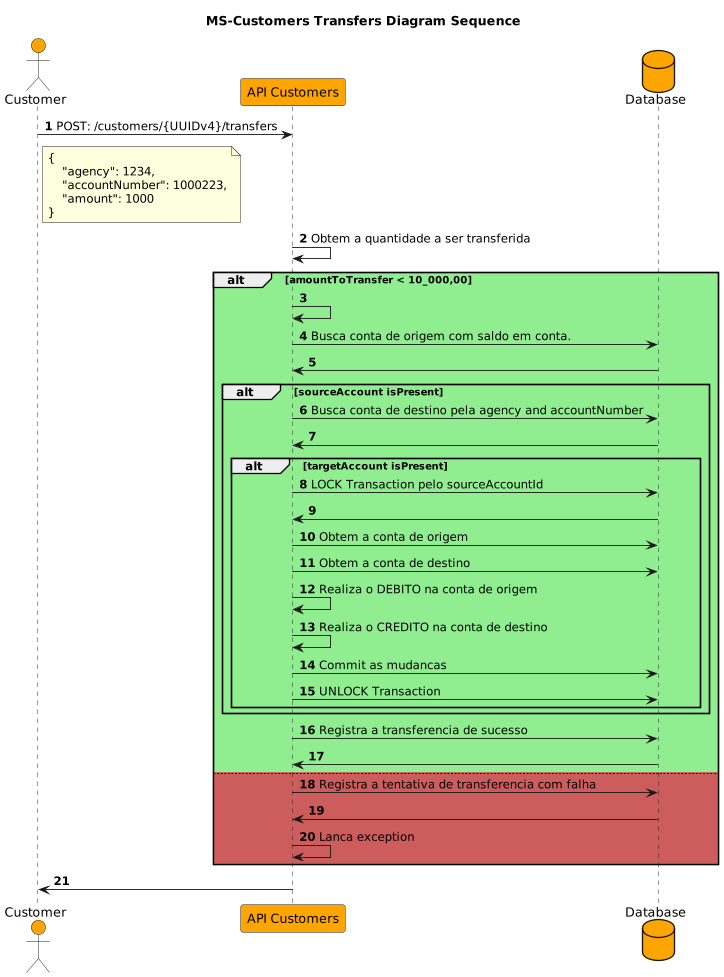

# Microservice Customers

API Customers 
Features
- Cadastro de clientes e contas.
- Listagem de todos os clientes.
- Filtro na listagem por numero da conta.
- Transferencia bancaria entre contras, com valor maximo da transferencia de R$10.000,00.
- Bloqueio de concorrencia nas transferencias.
- Registro de tentativas de transferencia com sucesso e falhas.
- Listagem das transferencias realizadas de cada usuario.
- Testes de Integracao
  - [ms-customers-automated-tests-rest-assured](https://github.com/andrelsf/ms-accounts-automated-tests)

### Requirements
 - Java 21
 - Maven 3.8+
 - IDE VSCode or Intellij
 - NOTA: Base de dados H2, ou seja, base em memoria.
 - Design de desenvolvimento em Camadas: Controller, Service e repository
 - Docker e docker-compose (Opcional)

### (Opcional) Docker

```shell
# Build and run
docker-compose up -d

# Stop and remove container
docker-compose down
```

---

### Recursos

|  Method  |             Headers             | Resource                                    | Status Codes  | Description                                             |
|:--------:|:-------------------------------:|:--------------------------------------------|:-------------:|:--------------------------------------------------------|
|  `POST`  | Content-Type: application/json  | `/api/v1/customers`                         | 201, 409, 500 | Registra um novo cliente e sua conta.                   |
|  `GET`   | Content-Type: application/json  | `/api/v1/customers`                         |   200, 500    | Obtem a listagem de todos os clientes ATIVOS (default). |
|  `GET`   | Content-Type: application/json  | `/api/v1/customers?status=INACTIVE`         | 200, 404, 500 | Obtem a listagem de todos os clientes INATIVOS.         |
|  `GET`   | Content-Type: application/json  | `/api/v1/customers?accountNumber=1234`      | 200, 404, 500 | Filtragem de todos os clientes pelo numero da conta.    |
|  `GET`   | Content-Type: application/json  | `/api/v1/customers?page=0&size=10`          |   200, 500    | Controle de paginacao.                                  |
|  `GET`   | Content-Type: application/json  | `/api/v1/customers/{customerId}`            | 200, 404, 500 | Obtem o registro do cliente pelo ID.                    |
| `DELETE` | Content-Type: application/json  | `/api/v1/customers/{customerId}`            | 204, 404, 500 | (Delete Logico) Inativa um cliente pelo ID.             |
| `PATCH`  | Content-Type: application/json  | `/api/v1/customers/{customerId}`            | 204, 404, 500 | Ativa um cliente pelo ID.                               |
|  `POST`  | Content-Type: application/json  | `/api/v1/customers/{customerId}/transfers`  | 200, 422, 500 | Realiza transferencia entre contas.                     |
|  `GET`   | Content-Type: application/json  | `/api/v1/customers/{customerId}/transfers`  | 200, 404, 500 | Obtem a listagem de todas as transferencias realizadas. |

### Exemplos com cURL

#### Registra um novo cliente
```shell
curl -v --request POST \
--location 'http://localhost:8091/api/v1/customers' \
--header 'Content-Type: application/json; charset=utf-8' \
--data '{
    "name": "Jose Nome Facil",
    "cpf": "11122233344",
    "account": {
        "agency": 9876,
        "accountNumber": 1007659
    }
}'
```
Exemplo de resposta
```shell
< HTTP/1.1 201 Created
< Connection: keep-alive
< Location: /api/v1/customers/b5f849d6-5ebb-4fb6-a3c4-49e8bdcb1acc
< Content-Length: 0
< Date: Wed, 07 Aug 2024 02:46:36 GMT
```

> `NOTA`: Pelo header location e especificado como acessar o recurso registrado.

> `Este endpoint trata duplicidade caso tenha uma nova tentativa de registrar com mesmo CPF sera retornado 409 Conflict.`

---

#### Obtem a listagem de todos os clientes registrados paginado.

```shell
curl --request GET \
--location 'http://localhost:8091/api/v1/customers?page=0&size=10' \
--header 'Content-Type: application/json; charset=utf-8'
```

---

#### Obtem o registro de um unico cliente pelo ID

```shell
curl --request GET \
--location 'http://localhost:8091/api/v1/customers/3d05773e-513e-11ef-85b4-938a0beed59a' \
--header 'Content-Type: application/json; charset=utf-8'
```

Exemplo de resposta formatada
```json
{
    "customerId": "3d05773e-513e-11ef-85b4-938a0beed59a",
    "name": "Alice Bar",
    "cpf": "22233344448",
    "account": {
        "accountId": "3d05773e-513e-11ef-85b4-938a0beed59a",
        "agency": 1234,
        "accountNumber": 1000112,
        "status": "ACTIVE",
        "balance": 10000.00,
        "createdAt": "2024-08-06T22:13:14.986138-03:00",
        "lastUpdated": "2024-08-06T22:13:14.986138-03:00"
    }
}
```

---

#### Realiza filtro no recurso clientes pelo numero da conta.

```shell
curl --request GET \
--location 'http://localhost:8091/api/v1/customers?accountNumber=1000112' \
--header 'Content-Type: application/json'
```

Exemplo de resposta do filtro por numero da conta
```json
[
    {
        "customerId": "3d05773e-513e-11ef-85b4-938a0beed59a",
        "name": "Alice Bar",
        "cpf": "22233344448",
        "account": {
            "accountId": "3d05773e-513e-11ef-85b4-938a0beed59a",
            "agency": 1234,
            "accountNumber": 1000112,
            "status": "ACTIVE",
            "balance": 10000.00,
            "createdAt": "2024-08-06T19:19:26.608698-03:00",
            "lastUpdated": "2024-08-06T19:19:26.608698-03:00"
        }
    }
]
```

---

#### Tentativa de transferencia que excede o valor maximo permitido de R$10.000,00

```shell
curl --request POST \
--location 'http://localhost:8091/api/v1/customers/3d05773e-513e-11ef-85b4-938a0beed59a/transfers' \
--header 'Content-Type: application/json' \
--data '{
    "agency": 1234,
    "accountNumber": 1000223,
    "amount": 10001
}'
```

Resposta da tentativa de transferencia com valor que excede o permitido
```json
{
    "transferId": "e520dcfb-c0f0-40d1-8575-ec8b409b5c65",
    "targetAgency": 1234,
    "targetAccountNumber": 1000223,
    "amount": 10001,
    "status": "FAILED",
    "message": "Transfer amount not allowed",
    "transferDate": "2024-08-06T23:52:39.959638-03:00[America/Sao_Paulo]"
}
```

---

#### Transferencia da Alice para conta do Bob

```shell
curl --request POST \
--location 'http://localhost:8091/api/v1/customers/3d05773e-513e-11ef-85b4-938a0beed59a/transfers' \
--header 'Content-Type: application/json' \
--data '{
    "agency": 1234,
    "accountNumber": 1000223,
    "amount": 1000
}'
```

Exemplo de resposta
```json
{
    "transferId": "4b968174-b8dd-45cc-87a4-d310a2852e42",
    "targetAgency": 1234,
    "targetAccountNumber": 1000223,
    "amount": 1000,
    "status": "COMPLETED",
    "message": "Transfer completed successfully.",
    "transferDate": "2024-08-06T23:54:22.427619-03:00[America/Sao_Paulo]"
}
```

---

#### Obtem a lista de todas as transferencias realizadas pelo cliente

```shell
curl --request GET \
--location 'http://localhost:8091/api/v1/customers/3d05773e-513e-11ef-85b4-938a0beed59a/transfers' \
--header 'Content-Type: application/json'
```

```json
[
    {
        "transferId": "e520dcfb-c0f0-40d1-8575-ec8b409b5c65",
        "targetAgency": 1234,
        "targetAccountNumber": 1000223,
        "amount": 10001.00,
        "status": "FAILED",
        "message": "Transfer amount not allowed",
        "transferDate": "2024-08-06T23:52:39.959638-03:00"
    },
    {
        "transferId": "4b968174-b8dd-45cc-87a4-d310a2852e42",
        "targetAgency": 1234,
        "targetAccountNumber": 1000223,
        "amount": 1000.00,
        "status": "COMPLETED",
        "message": "Transfer completed successfully.",
        "transferDate": "2024-08-06T23:54:22.427619-03:00"
    }
]
```

---

#### Inativar o cliente pelo ID

```shell
curl -v --request DELETE \
--location 'http://localhost:8091/api/v1/customers/5ccac7a4-513e-11ef-9485-bbfbb6bdc7c6' \
--header 'Content-Type: application/json; charset=utf-8'
```

Exemplo resposta
```shell
< HTTP/1.1 204 No Content
< Date: Wed, 07 Aug 2024 23:56:13 GMT
```

---

#### Ativar o cliente pelo ID

```shell
curl -v --request PATCH \
--location 'http://localhost:8091/api/v1/customers/3d05773e-513e-11ef-85b4-938a0beed59a' \
--header 'Content-Type: application/json; charset=utf-8'
```

Exemplo de response
```shell
< HTTP/1.1 204 No Content
< Date: Thu, 08 Aug 2024 03:40:32 GMT
```

---

## Transfer: Diagram Sequence


